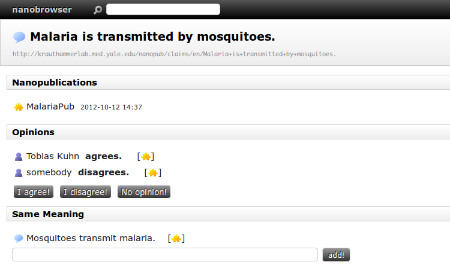
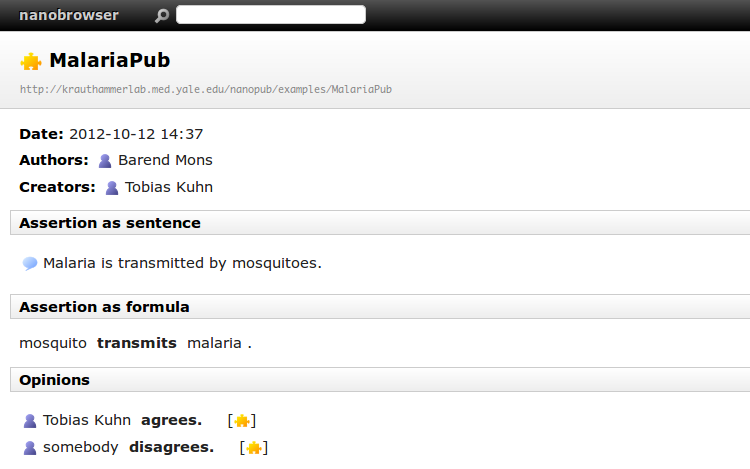

nanobrowser
===========

A browser for nanopublications.

Under construction...

Screenshots
-----------

Some screenshots of the browser interface:

Virtuoso
--------

Nanobrowser uses the Virtuoso triple store via its SPARQL endpoint.

The following commands have to be executed to configure the Virtuoso triple
store (TODO: this list might be incomplete and contain commands that are
actually unnecessary):

    GRANT EXECUTE ON DB.DBA.RDF_QUAD TO "SPARQL";
    GRANT EXECUTE ON DB.DBA.SPARUL_CLEAR TO "SPARQL";
    GRANT EXECUTE ON DB.DBA.SPARUL_DELETE TO "SPARQL";
    GRANT EXECUTE ON DB.DBA.SPARQL_DELETE_DICT_CONTENT TO "SPARQL";
    GRANT EXECUTE ON DB.DBA.SPARUL_DROP TO "SPARQL";

To allow for text indexing (not yet implemented):

    RDF_OBJ_FT_RULE_ADD(null, null, 'All');
    VT_INC_INDEX_DB_DBA_RDF_OBJ();
